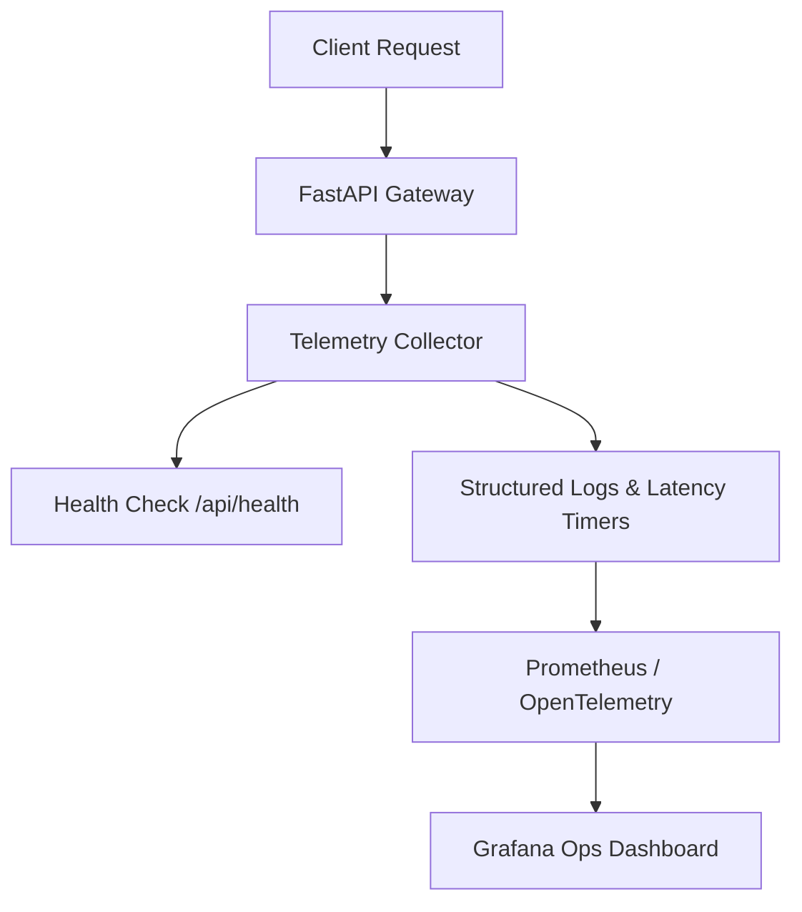

# Monitoring Dashboard & Operational Metrics Architecture

## 1. Overview
The Food Calorie App system exposes real-time operational signals across inference latencies, engine status, error rates, and user correction rates.

---

## 2. Core Operational Metrics & KPIs



### Key Health & Telemetry Metrics
1. **Engine Availability (`api_engine_status`)**:
   - Status of Detector, SAM Segmenter, Monocular Depth, VLM Verifier, and Postgres DB.
2. **Inference Latency Breakdown (`api_inference_duration_ms`)**:
   - Per-engine timers (`reference_scale_ms`, `detection_ms`, `vlm_ms`, `segmentation_ms`, `depth_ms`, `portion_ms`, `fusion_ms`, `db_persistence_ms`).
3. **Retry & Low-Confidence Rate (`api_retry_rate`)**:
   - Proportion of meal analyses flagged with `retry_recommended=True`.
4. **User Correction Frequency (`api_feedback_rate`)**:
   - Number of manual portion adjustments logged to the `feedback` table.
5. **Calorie Distribution & Outlier Rate (`api_outlier_count`)**:
   - MAD consensus rejection frequency (number of engines filtered out per meal item).

---

## 3. Real-Time Diagnostic Endpoint
* **Endpoint**: `GET /api/health`
* **Response Example**:
```json
{
  "status": "ok",
  "version": "1.0.0",
  "database": "connected",
  "environment": "production",
  "engines": {
    "engine_1_detector": "ready (yolo_v8/yolo_world)",
    "engine_2_segmenter": "ready (sam_fast/unet)",
    "engine_3_depth": "ready (depth_anything_v2)",
    "engine_4_portion": "ready (density_prior_regressor)",
    "engine_5_nutrition_db": "ready (usda_curated_seed)",
    "engine_5b_vlm_verifier": "ready (gemini_vision/clip_ranker)",
    "engine_6_mad_fusion": "ready (mad_outlier_consensus)",
    "reference_fiducial": "ready (fiducial_card_coin_detector)"
  }
}
```

