# Latency, Throughput, and Cost Performance Budgets

## 1. System Latency Targets (SLA)

| Metric | Target (CPU Mode) | Target (GPU Production Mode) | Hard Budget Cap |
|---|---|---|---|
| **End-to-End Latency (P50)** | `< 1200 ms` | `< 450 ms` | 2000 ms |
| **End-to-End Latency (P90)** | `< 2500 ms` | `< 850 ms` | 3500 ms |
| **End-to-End Latency (P95)** | `< 3500 ms` | `< 1200 ms` | 5000 ms |
| **End-to-End Latency (P99)** | `< 4800 ms` | `< 1800 ms` | 6000 ms |

---

## 2. Per-Engine Latency Budget Allocation

```mermaid
gantt
    title Multi-Engine Pipeline Latency Budget (Target: < 1200ms)
    dateFormat X
    axisFormat %s ms
    section Image Ingestion
    Upload & Decode : 0, 80
    Fiducial Reference : 80, 150
    section Vision Processing
    Engine 1 (YOLO Detector) : 150, 450
    Engine 5B (VLM Verifier) : 450, 750
    Engine 2 (SAM Segmenter) : 750, 950
    Engine 3 (Depth Estimator) : 950, 1100
    section Fusion & Nutrition
    Engine 4 + 6 (Portion & MAD Fusion) : 1100, 1150
    Engine 5 (DB Nutrition & Persist) : 1150, 1200
```

| Pipeline Step / Engine | CPU Budget | GPU Budget |
|---|---|---|
| **Payload Ingestion & Quality Check** | `< 50 ms` | `< 25 ms` |
| **Reference Object Scale Detection** | `< 80 ms` | `< 30 ms` |
| **Engine 1: YOLO Food Detection** | `< 400 ms` | `< 90 ms` |
| **Engine 5B: VLM Visual Verifier** | `< 500 ms` | `< 150 ms` |
| **Engine 2: Segmentation (SAM/UNet)** | `< 450 ms` | `< 120 ms` |
| **Engine 3: Monocular Depth Estimation**| `< 350 ms` | `< 90 ms` |
| **Engine 4 & 6: Density & MAD Fusion** | `< 30 ms` | `< 10 ms` |
| **Engine 5 & DB Persistence** | `< 40 ms` | `< 20 ms` |

---

## 3. Memory & Resource Constraints

* **Maximum Resident Memory (RSS)**: `< 1.8 GB` per backend container worker.
* **Peak GPU VRAM**: `< 3.5 GB` for batch size = 1 concurrent inference.
* **Worker Concurrency**: 2–4 uvicorn workers per container instance.

---

## 4. Cost Budget per Inference

* **Target Cloud Compute Cost**: `< $0.003` per analyzed meal on spot GPU (e.g. NVIDIA T4/A10G).
* **VLM Inference Cost**: Batched verification prompts restricted to ambiguous top-$K$ candidates, capped at `< $0.002` per request.
* **Monthly Active User Cost (3 meals/day, 90 meals/mo)**: `< $0.27 / user / month`.

